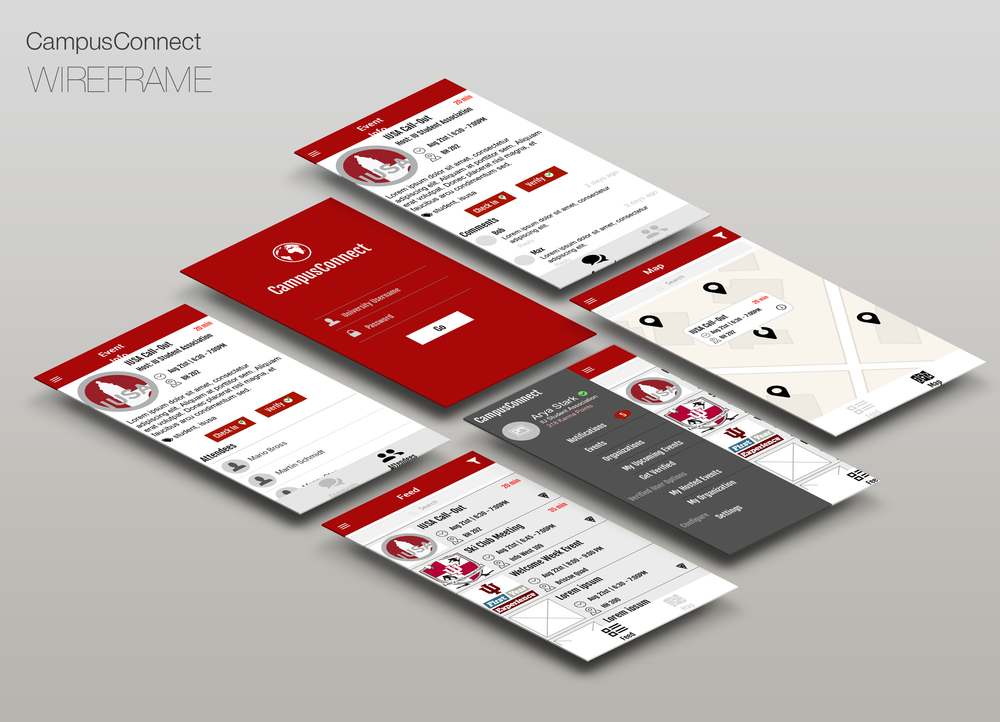

##### Beginning Stages
We wanted our project to focus on making it easier for students to find things they are interested in. At the time, there wasn't an easy way for IU students to find events and organizations that interest them. Information about events, clubs and other organizations were usually found on flyers scattered around campus or on Facebook. There wasn't really a unified way to finding that information. So, that's how we came up with CampusConnect.  

There needed to be a way for students to easily find events and clubs as well as a way for those clubs and organizations to get their information out there. 

##### Research & Analysis
To see if something like this was really a need for students, we conducted several interviews of IU students of various years and involvement. Majority of them told us that an app like CampusConnect could really be useful for students looking for things they are or could be interested. Some also told us that it would be especially beneficial for freshmen students. 

After our research, we made a Functionality List that included all the features and functions we wanted in the app. We ordered them by priority because there was a possibility that we wouldn't be able to implement all of the features to do time constraint. 

Once we listed all our features, we created Use Cases based on those features. 

##### Design
I was in charge of creating the overall design of the app. First, I drew up a quick sketch of the main screens of our app. After that, I created some wireframes, mockups and a simple digital prototype.

##### Development
I was also responsible for a large part of the development of our application. In the early stages of our project, we decided to develop a hybrid application as a opposed to a native one. So, instead of using Swift for iOS or Java for Android, we used the Ionic Framework and AngularJS to create a hybrid application that could operate on both iOS and Android without learning both languages. This decision ended up saving us a lot of time and stress. We were also able to produce a quality product in a limited amount of time.

One of the major issues we had in development was getting the database connected with our app. It basically brought our development to a complete halt. For some reason, we couldn't connect to our school's SQL database with PHP. So, we used a BaaS (Backend-As-A-Service) called BackAnd. Switching to this solved our database problem in minutes. Backand worked extremely well with Ionic and Angular and saved us so much time.

##### Finished Product
After a semester of development, we had a pretty decent working version of CampusConnect. 

CampusConnect was designed to be a private application so, all users must sign-up and login in order to actually use it. It's purpose was to be used by university students. 

Once a user was logged in, they could browse the upcoming events either on the Event Feed or by looking at the map. Once they tapped on an event, they would be taken to the Event Detail screen where they can view information about the event. In addition to basic information like date/time, location and event description, users could also view or post comments about the event. For example, if a user wanted to ask a question about the event, they can just post a comment and either the event's host or another user can respond. Users could also "Check-In" or RSVP to an event. If an event was happening at that moment, the user would be presented with a "Check-In" button. If the event hasn't happened yet, the user would be presented with a "RSVP" button. 

The app also has user roles. There are normal users and verified users. Verified Users are the only ones who can post, edit and delete their own events. Every user who wants to become verified must go through a verification process, in which the app's admin(s) must accept their request and manually change their user role to "Verified." 

Users also have user profiles that include their name, profile picture, karma points (karma points are added when a user checks in/RSVP to an event, posts a comment, etc.), and an optional bio.
