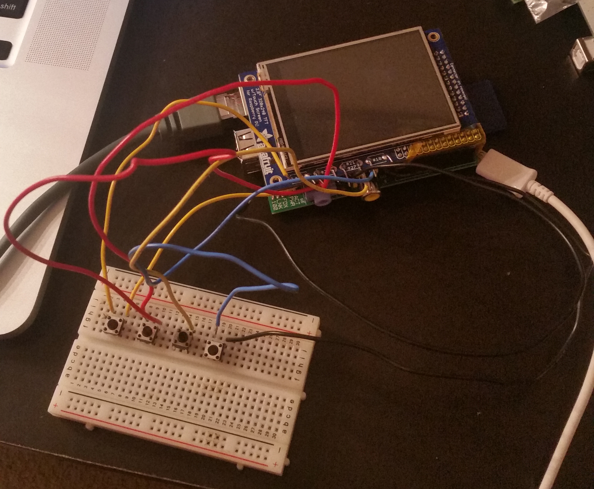

##### Beginning Stages
Our purpose for this project was to create a robot that could respond to its user's emotions and observe the human-robot interaction. We wanted to know how people would feel about a robot that could read their emotions and respond accordingly and how would they use it. 

Thinking about its potential uses, we designed two different designs: A more general design that could be used in a variety of applications and a more specific design that could be used as more of a emotional companion or a companion for children.

Technical-wise, we decided to use a Raspberry Pi and a TFL Screen for the "face" of the robot. The robot's expressions would display on the screen.

##### Development + Physical Computing
Once we knew what we wanted to do, I started building the prototype. I was in charge of all the hardware and programming parts of the project. 

While initially, we wanted the robot to be able to sense the user's emotions, we, unfortunately, had to simplify that feature because of time constraints. So, we opted for more of a manual way of telling the robot what emotion they are feeling by pushing certain buttons (happy, angry, sad, etc.).

The main (and hardest) part of the hardware portion of the project was getting the screen working with the Raspberry Pi. It took me several hours to get the screen working and displaying what I wanted it to. To do this, I had to install a lot things on the Raspberry Pi to get it talking to the screen. 

Once I got the screen working, next I started working on making the buttons work with the screen. Each button was supposed to display a different emotion on the screen. I used a breadboard to get the buttons working before I soldered them to the screen.

As for the exterior of the robot, we decided to 3D print it because it was the easiest way to get all the hardware components to fit exactly how we wanted them to. We had to do several iterations of each design before we got them the way we wanted. We then made it a little "cuter" by adding some fluff to the exterior.

##### Finished Prototype
While our prototype wasn't perfect, it was a good start for us if we wanted to do further research in this area of understanding the human-robot interaction between humans and expressive robots.

If I were to continue with this project, I would look further into adding a emotion sensing function for the robot. It would be a huge improvement if the robot could read the user's facial expressions or body language and behave depending on that. That would require us to add some sort of camera or sensor that is programmed to analyze the user's face and body language to determine what emotion the user is expressing. 

While that would improve the overall function of the robot, it would also raise some ethical/moral concerns. The robot would always be watching the user, which may make the user uncomfortable. If I were to do this, I must first address these possible issues to make the user more comfortable and more willing to use the robot. 